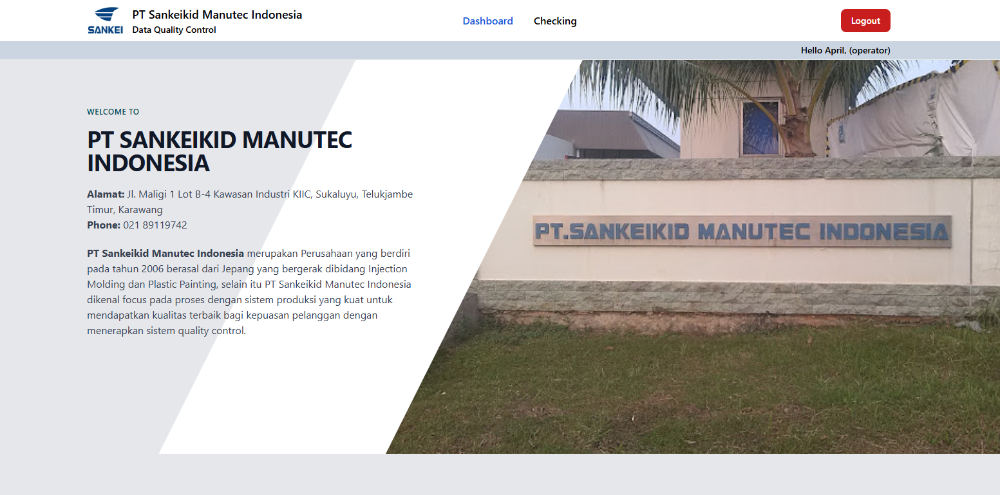

<p align="center"><a href="https://laravel.com" target="_blank"></a></p>

<p align="center">
<a href="https://github.com/laravel/framework/actions"></a>
<a href="https://packagist.org/packages/laravel/framework"></a>
</p>

## Requirements

- PHP Version 8.2
- Composer Version 2
- Enable PHP sqlite/mysql PDO extension
- NodeJS and NPM

## Installation

1. Install composer dependencies
```bash
  composer install
```

2. Copy env file
```bash
  cp .env.example .env
```

3. Generate key app
```bash
  php artisan key:generate
```

4. Run migration for database
```bash
  php artisan migrate --seed
```

5. Install node dependencies
```bash
  npm install
```

6. Build assets
```bash
  npm run build
```

7. Run Project and open in http://127.0.0.1:8000
```bash
  php artisan serve
```

## Default Account

| Operator 1 |                 |
|------------|-----------------|
| Username   | april@email.com |
| Password   | operatorapril   |

| Operator 2 |                |
|------------|----------------|
| Username   | budi@email.com |
| Password   | operatorbudi   |

| Supervisor |                      |
|------------|----------------------|
| Username   | supervisor@email.com |
| Password   | super12345           |

## License

This app is licensed under the [MIT license](https://opensource.org/licenses/MIT).
